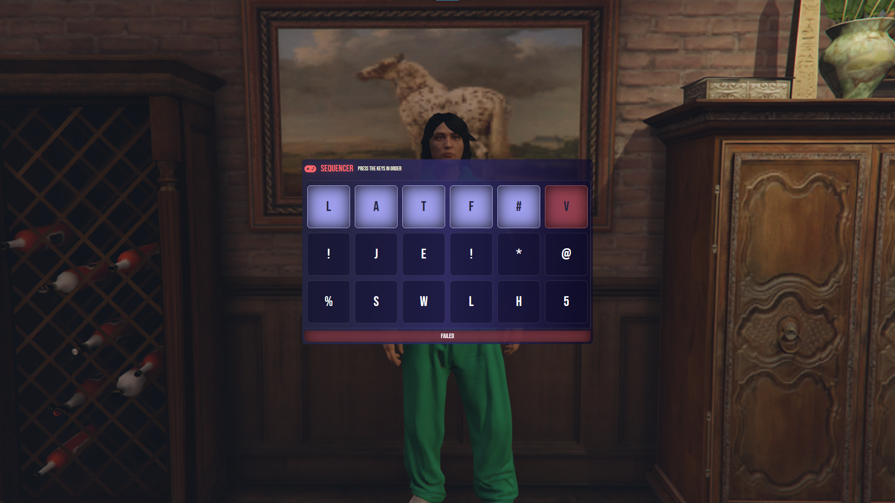

# This is a minigame Inspired by NoPixel




# Useage:

```lua
    exports['sequence-minigame']:KeySequence(function (success)
        if success then
            print('success')
        else
            print('failure')
        end
    end, 10, 'alphabet') -- time in seconds, type = ("alphabet" which show only letters / "all" which shows letters, symbols, and numbers)
```